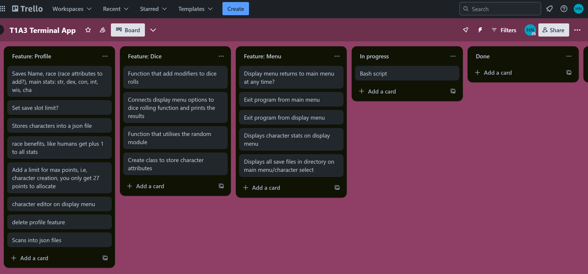
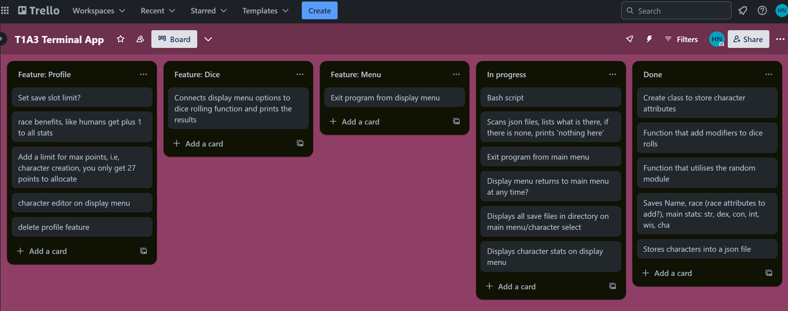
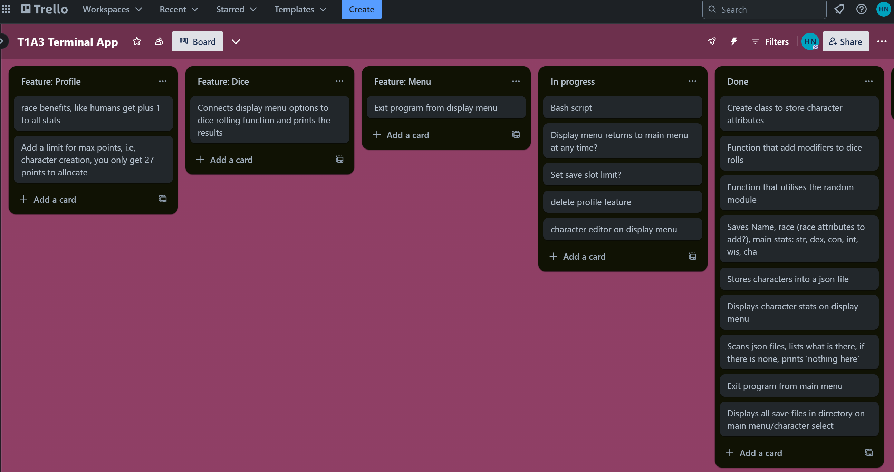
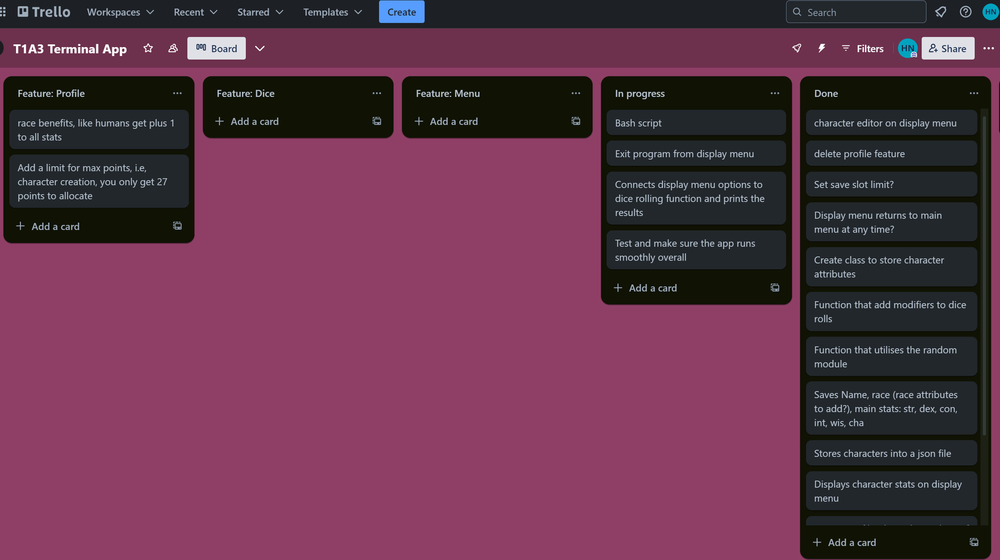

# T1A3 Python Terminal App:

## *Dungeons and Dragons chracter sheet with dice roll*

## Source Control Repository:

### [Link to Github](https://github.com/taijitsuhitsyou/T1A3-Python-Terminal-App)

## Code Style Guide:
### Coded according to [PEP 8](https://peps.python.org/pep-0008/) styling 

## Features

### 1. Create, edit and delete profiles

On this app, you can create and store up to 5 profiles of a Dnd character. I narrowed down the scope due to the deadline, but it would not be hard to increase the amount of character details stored. Currently, the app accepts and displays information related to character name, character race and the 6 main dungeons and dragons stats; strength, dexterity, constitution, intelligence, wisdom and charisma.

#### Create:

This feature is accesssible from the main menu/character select screen (which we will call 'main menu'), by pressing '0'. The create feature will firstly scan the directory for any existing saved files. If this number exceeds 5 then a notification will prompt the user to delete a profile before they can create a new one. If the saved file count is below 5, the user will be guided by text on how to create their character. The app will then automatically create a save profile based on the name and race of the character, for example; 'Dave the Orc'. If there is a duplicate name, the app will add the prefix 'another' to the new save file to preventing unwanted overwriting, for example: 'another Dave the Orc'. After character creation, the app will take the user to the display menu.

#### Edit:

In the character stat sheet display menu (which will be referred to as 'display menu'), will be an option to edit all details of the character. It is accessible by pressing '1'  on the display menu. This will delete the previous saved version of the file and essentially prompt the user to create a new save profile. After editing the character, the app will take the user to the display menu. 

#### Delete: 

The delete feature is accessed from the main menu by inputting '000'. It will scan the directory for any save files, and display them on a numbered list. The user can then input the relevant number to delete the character profile. As this is permanent, there is a double check function, in which the user has to confirm whether they want to continue. A 'y' input will delete the profile and an 'n' input will return the user back to the main menu.

### 2. Stimulated dice rolls (D20)

From the display menu page, accessed after the user selects / creates a character, there are dice roll actions. The app uses the random module to randomly produce a number between 1-20, akin to a d20 dice. Each stat can be individually rolled for, which will then add a modifier depending on the selected character's stats. For example, if the character has a strength stat of 14, the app will display the original 'roll' result, the modifier (in this case: +2) and the modified result (original roll + modifier).

### 3. Menu display and Navigation

The menus use while loops to aid in nagivation around the app. This is applied to a program exit feature that can be used from both the main menu and the display menu. When 'iquit' is an option and users type it in, it will raise an error that allows the user to exit the program. There is another loop used to allow the user to return to the main menu from the display menu. 

## Development plan / Progress tracker:

### Initial plan: 

- Intention was to add a feature that did more with race and class, in addition to perhaps a point cap. However, it was not relevant, as the app's main purpose was making dice rolls based on the stats users entered themselves, which could be edited at any time.

### Day 1 progress (8/05/24): 

- Make a functional dice module
- Make a save system with json files
- Make a method to display those json files as a list and select desired file based on user input.
- Make a exit program function from the main menu

### Day 2 progress (9/05/24): 

- Make a save slot limit (I did want too many json files clogging up the directory)
- Make a profile edit and delete function

### Day 3 progress (10/05/24): 

- Make a return the main menu function from the display menu
- Linking the dice function to the display menu prompts.
- Testing the program runs smoothly and fixing any errors that come up


## Installation Guide:

Run this line of code in the same directory as the README.md: 

```
 ./script.sh
 ```

If permission is needed, run this as well:

```
chmod +x script.sh
```

## System & Hardware Requirements:

#### Made and tested on [Python version 3.10.12](https://www.python.org/downloads/release/python-31012/)

You can check your version of Python by running the following command:

```
python --version
```

### Dependencies:

**Standard library:**

- Random module
- Os module
- Json module

**External Packages:**

- markdown-it-py version 3.0.0
- mdurl version 0.1.2
- Pygments version2.18.0
- rich version 13.7.1

## Acknowledges & References:

C. Ross, ConnorRoss_T1A3_Wordle, (2023), Github repository, https://github.com/Connorswebdev/ConnorRoss_T1A3_Wordle

A. Han, Terminal-Application-Contact-Lens-Organiser, (2023), Github repository, https://github.com/ahan-nz/Terminal-Application-Contact-Lens-Organiser

I. Willet, terminal-app, (2023), GitHub repository,https://github.com/ibehanwillett/Coder-Acad/tree/main/terminal-app 